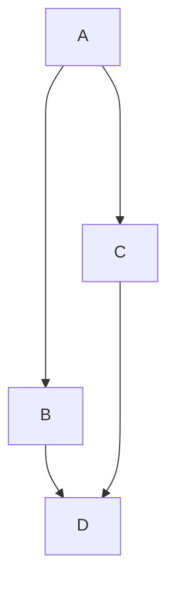
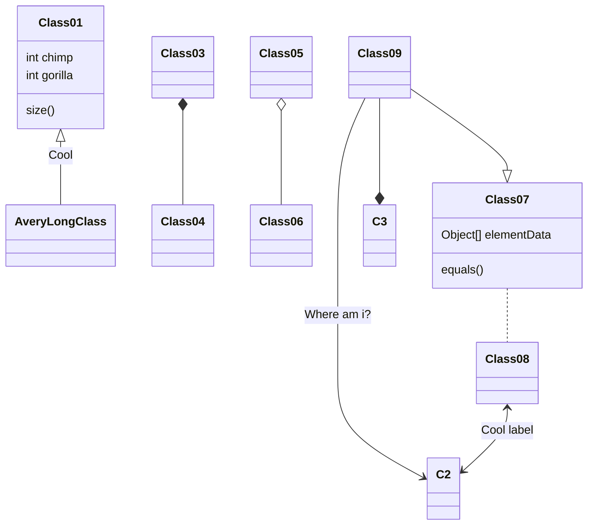
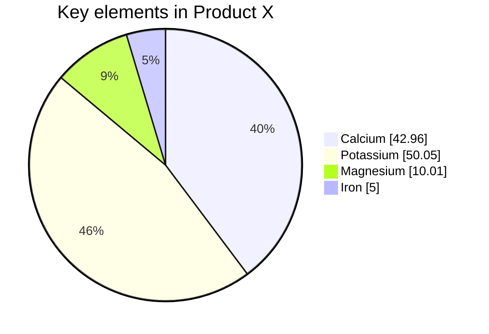

- [Ссылка на диаграммы](https://docs.github.com/en/get-started/writing-on-github/working-with-advanced-formatting/creating-diagrams#creating-stl-3d-models)
- [Ссылка на диаграммы 2](https://mermaid-js.github.io/mermaid/#/)

$\LARGE\textrm {Это\ заголовок}$

- [Команды смены шрифта](http://tex.imm.uran.ru/tex/2e/lshort2e/node66.html)

$\tiny\Biggl[{Hello}\Biggr]$

$\scriptsize{Hello}$

$\small{Hello}$

$\normalsize{Hello}$

$\large\textbf{\textit{Hello}}$

$\Large\it\color[gray]{0.7}{Hello}$

$\LARGE\rm{Hello}$

$\huge\sf{Hello}$

$\Huge\tt\bf\color[RGB]{155,127,0}{Hello}$

---

$\sqrt{x^2} = \pm x$ 

$x +\frac{x+1}{x +\frac{x+1}{x+\frac{1}{x +1}}}$

$\int_a^b  \lim_{x\to0} $

$\sum\nolimits _{i=0} ^ \infty$

$\int\limits_a^b \sum\nolimits_{i-0}^\infty$

$\Biggl(\biggl(\Bigl(\bigl((t+y)\bigr)\Bigr)\biggr)\Biggr)$

[Ссылка](https://docs.github.com/en/get-started/writing-on-github/working-with-advanced-formatting/creating-diagrams#creating-stl-3d-models)

